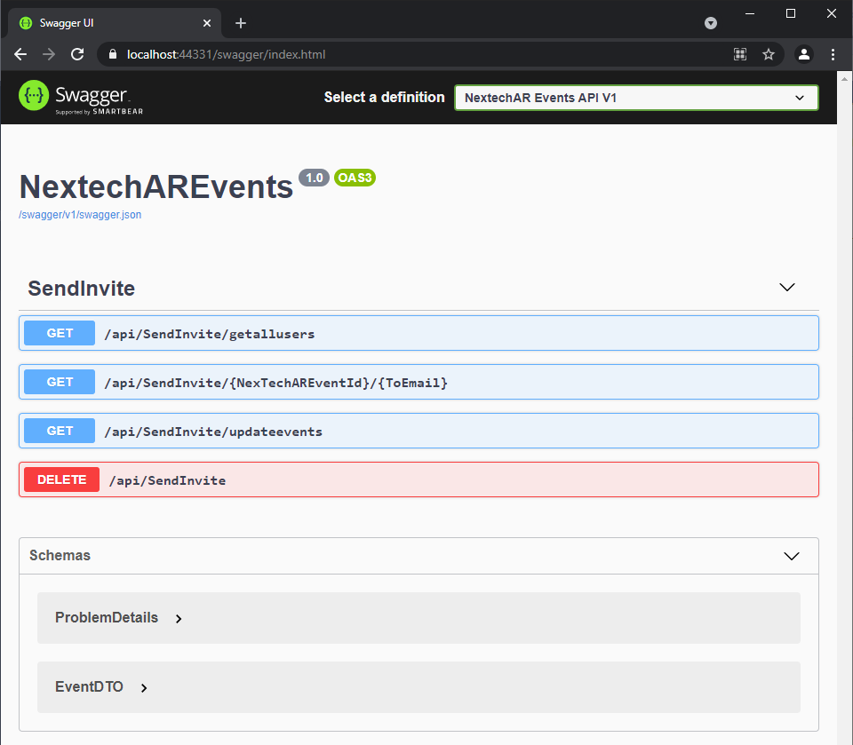

 # WebAPI POC demo to create MS Graph Events from Inferno Events. 

  - [Pre-requisites](#pre-requisites)
  - [Setup](#setup)
    - [Step 1:  Clone or download this repository](#step-1-clone-or-download-this-repository)
    - [Step 2:  Register the sample applications with your Azure Active Directory tenant](#step-2-register-the-sample-applications-with-your-azure-active-directory-tenant)
      - [Choose the Azure AD tenant where you want to create your applications](#choose-the-azure-ad-tenant-where-you-want-to-create-your-applications)
      - [Register the service app (NextechAREvents)](#register-the-service-app-webapi-multitenant-todolistservice-v2)
      - [Configure the service app (NextechAREvents) to use your app registration](#configure-the-service-app-webapi-multitenant-todolistservice-v2-to-use-your-app-registration)
    - [Step 4: Run the sample](#step-4-run-the-sample)
      - [Run the sample using Visual Studio](#run-the-sample-using-visual-studio)
      - [Run the sample using a command line interface such as VS Code integrated terminal](#run-the-sample-using-a-command-line-interface-such-as-vs-code-integrated-terminal)
        - [Step 1. Install .NET Core dependencies](#step-1-install-net-core-dependencies)
        - [Step 2. Trust development certificates](#step-2-trust-development-certificates)
        - [Step 3. Run the applications](#step-3-run-the-applications)

## Pre-requisites

- [Visual Studio](https://visualstudio.microsoft.com/downloads/)
- An Azure Active Directory (Azure AD) tenant. For more information on how to get an Azure AD tenant, see [How to get an Azure AD tenant](https://azure.microsoft.com/documentation/articles/active-directory-howto-tenant/)
- A user account in your Azure AD tenant. 

## Setup

### Step 1:  Clone or download this repository

From your shell or command line:

```Shell
git clone https://github.com/JolokiaCorporation/nextech-calendar-service-poc.git

```

or download and extract the repository .zip file.

### Step 2:  Register the sample applications with your Azure Active Directory tenant

Follow the steps below to manually walk through the steps to register and configure the applications in the Azure portal.

#### Choose the Azure AD tenant where you want to create your applications

As a first step you'll need to:

1. Sign in to the [Azure portal](https://portal.azure.com).
2. If your account is present in more than one Azure AD tenant, select your profile at the top right corner in the menu on top of the page, and then **switch directory** to change your portal session to the desired Azure AD tenant..

#### Register the service app (NextechAREvents)

1. Navigate to the Microsoft identity platform for developers [App registrations](https://go.microsoft.com/fwlink/?linkid=2083908) page.
1. Select **New registration**.
1. In the **Register an application page** that appears, enter your application's registration information:
   - In the **Name** section, enter a meaningful application name that will be displayed to users of the app, for example `NextechAREvents` or another name as you wish.
   - Under **Supported account types**, select **Accounts in any organizational directory (Any Azure AD directory - Multitenant) and personal Microsoft accounts (e.g. Skype, Xbox)
**.
   - In the **Redirect URI (optional)** section, select **Web** in the combo-box and enter the following redirect URI: `https://localhost:44351/api/Home` or the URL where you will run the WebAPI.
1. Select **Register** to create the application.
1. In the app's registration screen, find and note the **Application (client) ID**. You use this value in your app's configuration file(s) later in your code.
1. Select **Save** to save your changes.
1. In the app's registration screen, click on the **Certificates & secrets** blade in the left to open the page where we can generate secrets and upload certificates.
1. In the **Client secrets** section, click on **New client secret**:
   - Type a key description (for instance `app secret`),
   - Select one of the available key durations (**In 1 year**, **In 2 years**, or **Never Expires**) as per your security posture.
   - The generated key value will be displayed when you click the **Add** button. Copy the generated value for use in the steps later.
   - You'll need this key later in your code's configuration files. This key value will not be displayed again, and is not retrievable by any other means, so make sure to note it from the Azure portal before navigating to any other screen or blade.
1. In the app's registration screen, click on the **API permissions** blade in the left to open the page where we add access to the APIs that your application needs.
   - Click the **Add a permission** button and then,
   - Ensure that the **Microsoft APIs** tab is selected.
   - In the *Commonly used Microsoft APIs* section, click on **Microsoft Graph**
   - In the **Application permissions** section, select the **User.Read.All**,  **Mail.Send** and **Calendars.ReadWrite** in the list. Use the search box if necessary.
   - Click on the **Add permissions** button at the bottom.
1. Click on **Grant admin consent for Nextech AR solutions**

#### Configure the service app (NextechAREvents) to use your app registration

Open the project in your IDE (like Visual Studio or Visual Studio Code) to configure the code.

>In the steps below, "ClientID" is the same as "Application ID" or "AppId".

1. Open the `NextechAREvents\appsettings.json` file
1. Find the app key `TenantId` and replace the existing value with the TenantId from your AzureAD tenant.
1. Find the app key `ClientId` and replace the existing value with the application ID (clientId) of the `NextechAREvents` application copied from the Azure portal.
1. Find the app key `ClientSecret` and replace the existing value with the key you saved during the creation of the `NextechAREvents` app, in the Azure portal.
1. Replace the `DefaultOrganizerUserId` with a valid user id in you AzureAD, this will be the organizer for all event send through the WebAPI.
1. Check for the InfernoAPIUrl, this must be the URL for the Inferno WebAPI to obtain the Inferno Events.
1. Find the InfernoAPIKey and replace for the user InfernoAPIKey that you wish to use to gain access to the InfernoAPI to obtain the Events.
1. Find the `DefaultConnection` and replace with a valid connection string to a SQLServer database instance.


### Step 2: Run the sample

You can run the sample by using either Visual Studio or command line interface as shown below:

#### Run the sample using Visual Studio

Clean the solution, rebuild the solution, then go to View menu, then Other Windows, then click on **Package Manager Console**, and run the `update-database` command and wait for successful database creation, at last run the WebAPI from VisualStudio.

When you start the Web API from Visual Studio, depending on the browser you use, you'll get the swagger index.



